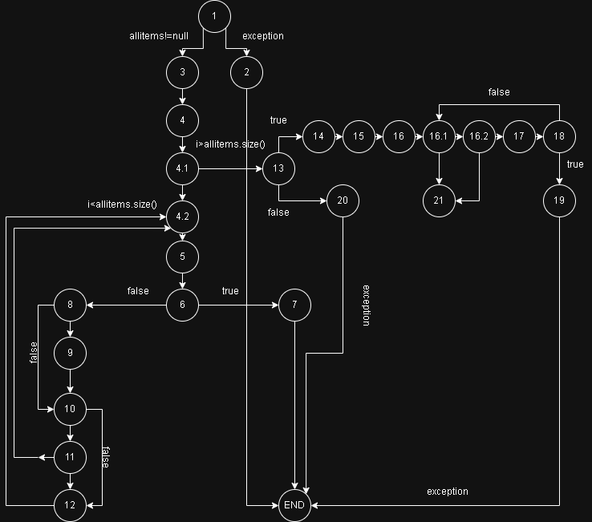

# Домашна задача 2 - Софтверско инженерство

# Marko Petkovski 233049

---

## Барање 1: Control Flow Graph (CFG)



---

## Барање 2: Цикломатска комплексност

**Формула:**  
V(G) = E - N + 2  
каде што:
- E = број на ребра = 31
- N = број на јазли = 24
- P = број на конективни компоненти = 1

**Резултат:**  
V(G) = 31 - 24 + 2 = **9**

**Објаснување:**  
Цикломатската комплексност од 9 значи дека постојат 9 независни патеки низ функцијата. Ова е резултат на:
- 5 различни условни изрази (`if`)
- 2 циклуси (`for`)
- логички услов со 3 под-услови (во едно `if`)

---

## Барање 3: Тестирање според Every Statement

| Тест  | Опис                                             | Очекувано |
|-------|--------------------------------------------------|-----------|
| Test1 | `allItems = null`                                | Исклучок |
| Test2 | Предмет со `null` име                            | Исклучок |
| Test3 | Предмет без попуст, валидна картичка             | Сума без пенал |
| Test4 | Предмет со попуст и услов за пенал               | Сума со попуст и пенал |
| Test5 | Картичка со невалидна должина                    | Исклучок |
| Test6 | Картичка со невалиден карактер                   | Исклучок |

Мора да има 6 минимум тест случаи.

---

## Барање 4: Multiple Condition тестирање
| Цена > 300 | Попуст > 0 | Количина > 10 | Опис                  |
|:----------:|:----------:|:-------------:|:----------------------|
|  неточно   |  неточно   |неточно             | Без услов исполнет     |
|     неточно       |  неточно   | точно          | Само количина          |
|     неточно       |   точно    | неточно             | Само попуст            |
|     неточно       |     точно      | точно            | Попуст + количина      |
|     точно      |  неточно   | неточно             | Само висока цена       |
|     точно      |  неточно   | точно            | Цена + количина        |
|     точно     |     точно    | неточно            | Цена + попуст          |
|     точно     |     точно      | точно            | Сите услови исполнети  |
Според Multiple Condition критериумот, потребно е да се тестират сите комбинации од условите за да се осигура дека логичката изјава работи правилно за секоја варијанта.

Минимално се потребни 4 тест случаи.

**Услов:**
```java
if (item.getPrice() > 300 || item.getDiscount() > 0 || item.getQuantity() > 10)
```

# Случај 1:
Бидејќи цената надминува 300, условот веднаш се исполнува. Бидејќи се работи за логичка "ИЛИ" операција, останатите проверки (за попуст и количина) нема ни да се извршат. Резултат: условот е исполнет.

# Случај 2:
Првата проверка за цена паѓа (бидејќи 100 < 300), но следниот дел од условот — попустот е поголем од 0 — е вистинит. Тоа е доволно за условот да се прифати како точен, а третиот дел (количина > 10) нема ни да се провери.

# Случај 3:
Ниту првиот, ниту вториот услов не се исполнети. Но, бидејќи количината е над 10, третиот услов го спасува целиот израз. Значи, и покрај двата неуспеха, условот како целина поминува.

# Случај 4:
Ниту една од трите проверки не е успешна. Цената е под 300, нема попуст, и количината е 8 што не е над 10. Затоа, целосниот услов не се исполнува.

